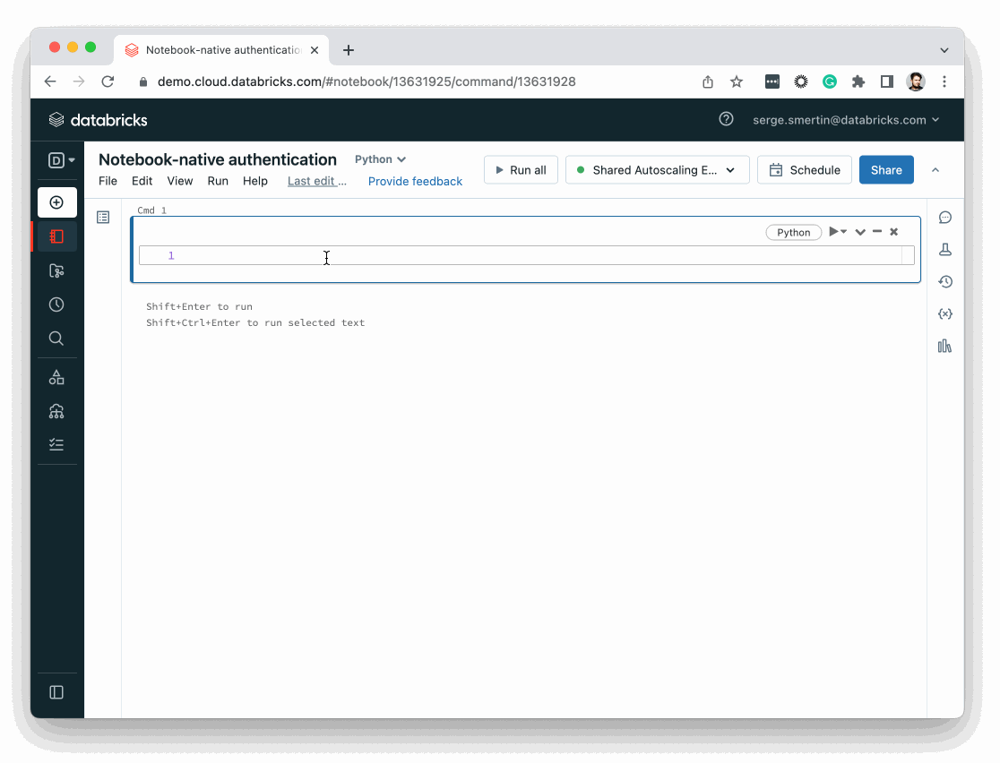

# Authentication

If you use Databricks [configuration profiles](https://docs.databricks.com/dev-tools/auth.html#configuration-profiles)
or Databricks-specific [environment variables](https://docs.databricks.com/dev-tools/auth.html#environment-variables)
for [Databricks authentication](https://docs.databricks.com/dev-tools/auth.html), the only code required to start
working with a Databricks workspace is the following code snippet, which instructs the Databricks SDK for Python to use
its [default authentication flow](#default-authentication-flow):

```python
from databricks.sdk import WorkspaceClient
w = WorkspaceClient()
w. # press <TAB> for autocompletion
```

The conventional name for the variable that holds the workspace-level client of the Databricks SDK for Python is `w`, which is shorthand for `workspace`.

(notebook-native-authentication)=
## Notebook-native authentication

If you initialise `WorkspaceClient` without any arguments, credentials will be picked up automatically from the notebook context. 
If the same code is run outside the notebook environment, like CI/CD, you have to supply [environment variables](https://docs.databricks.com/dev-tools/auth.html#environment-variables) for the authentication to work.    



`databricks.sdk.AccountClient` does not support notebook-native authentication.

(default-authentication-flow)=
## Default authentication flow

If you run the [Databricks Terraform Provider](https://registry.terraform.io/providers/databrickslabs/databricks/latest),
the [Databricks SDK for Go](https://github.com/databricks/databricks-sdk-go), the [Databricks CLI](https://docs.databricks.com/dev-tools/cli/index.html),
or applications that target the Databricks SDKs for other languages, most likely they will all interoperate nicely together.
By default, the Databricks SDK for Python tries the following [authentication](https://docs.databricks.com/dev-tools/auth.html) methods,
in the following order, until it succeeds:

1. [Databricks native authentication](#notebook-native-authentication)
2. [Azure native authentication](#azure-native-authentication)
4. If the SDK is unsuccessful at this point, it returns an authentication error and stops running.

You can instruct the Databricks SDK for Python to use a specific authentication method by setting the `auth_type` argument
as described in the following sections.

For each authentication method, the SDK searches for compatible authentication credentials in the following locations,
in the following order. Once the SDK finds a compatible set of credentials that it can use, it stops searching:

1. Credentials that are hard-coded into configuration arguments.

   :warning: **Caution**: Databricks does not recommend hard-coding credentials into arguments, as they can be exposed in plain text in version control systems. Use environment variables or configuration profiles instead.

2. Credentials in Databricks-specific [environment variables](https://docs.databricks.com/dev-tools/auth.html#environment-variables).
3. For Databricks native authentication, credentials in the `.databrickscfg` file's `DEFAULT` [configuration profile](https://docs.databricks.com/dev-tools/auth.html#configuration-profiles) from its default file location (`~` for Linux or macOS, and `%USERPROFILE%` for Windows).
4. For Azure native authentication, the SDK searches for credentials through the Azure CLI as needed.

Depending on the Databricks authentication method, the SDK uses the following information. Presented are the `WorkspaceClient` and `AccountClient` arguments (which have corresponding `.databrickscfg` file fields), their descriptions, and any corresponding environment variables.

## Databricks native authentication

By default, the Databricks SDK for Python initially tries [Databricks token authentication](https://docs.databricks.com/dev-tools/api/latest/authentication.html) (`auth_type='pat'` argument). If the SDK is unsuccessful, it then tries Databricks basic (username/password) authentication (`auth_type="basic"` argument).

- For Databricks token authentication, you must provide `host` and `token`; or their environment variable or `.databrickscfg` file field equivalents.
- For Databricks basic authentication, you must provide `host`, `username`, and `password` _(for AWS workspace-level operations)_; or `host`, `account_id`, `username`, and `password` _(for AWS, Azure, or GCP account-level operations)_; or their environment variable or `.databrickscfg` file field equivalents.

| Argument     | Description | Environment variable |
|--------------|-------------|-------------------|
| `host`       | _(String)_ The Databricks host URL for either the Databricks workspace endpoint or the Databricks accounts endpoint. | `DATABRICKS_HOST` |     
| `account_id` | _(String)_ The Databricks account ID for the Databricks accounts endpoint. Only has effect when `Host` is either `https://accounts.cloud.databricks.com/` _(AWS)_, `https://accounts.azuredatabricks.net/` _(Azure)_, or `https://accounts.gcp.databricks.com/` _(GCP)_. | `DATABRICKS_ACCOUNT_ID` |
| `token`      | _(String)_ The Databricks personal access token (PAT) _(AWS, Azure, and GCP)_ or Azure Active Directory (Azure AD) token _(Azure)_. | `DATABRICKS_TOKEN` |
| `username`   | _(String)_ The Databricks username part of basic authentication. Only possible when `Host` is `*.cloud.databricks.com` _(AWS)_. | `DATABRICKS_USERNAME` |
| `password`   | _(String)_ The Databricks password part of basic authentication. Only possible when `Host` is `*.cloud.databricks.com` _(AWS)_. | `DATABRICKS_PASSWORD` |

For example, to use Databricks token authentication:

```python
from databricks.sdk import WorkspaceClient
w = WorkspaceClient(host=input('Databricks Workspace URL: '), token=input('Token: '))
```

(azure-native-authentication)=
## Azure native authentication

By default, the Databricks SDK for Python first tries Azure client secret authentication (`auth_type='azure-client-secret'` argument). If the SDK is unsuccessful, it then tries Azure CLI authentication (`auth_type='azure-cli'` argument). See [Manage service principals](https://learn.microsoft.com/azure/databricks/administration-guide/users-groups/service-principals).

The Databricks SDK for Python picks up an Azure CLI token, if you've previously authenticated as an Azure user by running `az login` on your machine. See [Get Azure AD tokens for users by using the Azure CLI](https://learn.microsoft.com/azure/databricks/dev-tools/api/latest/aad/user-aad-token).

To authenticate as an Azure Active Directory (Azure AD) service principal, you must provide one of the following. See also [Add a service principal to your Azure Databricks account](https://learn.microsoft.com/azure/databricks/administration-guide/users-groups/service-principals#add-sp-account):

- `azure_workspace_resource_id`, `azure_client_secret`, `azure_client_id`, and `azure_tenant_id`; or their environment variable or `.databrickscfg` file field equivalents.
- `azure_workspace_resource_id` and `azure_use_msi`; or their environment variable or `.databrickscfg` file field equivalents.

| Argument              | Description | Environment variable |
|-----------------------|-------------|----------------------|
| `azure_workspace_resource_id`   | _(String)_ The Azure Resource Manager ID for the Azure Databricks workspace, which is exchanged for a Databricks host URL. | `DATABRICKS_AZURE_RESOURCE_ID` |
| `azure_use_msi`       | _(Boolean)_ `true` to use Azure Managed Service Identity passwordless authentication flow for service principals. | `ARM_USE_MSI` |
| `azure_client_secret` | _(String)_ The Azure AD service principal's client secret. | `ARM_CLIENT_SECRET` |
| `azure_client_id`     | _(String)_ The Azure AD service principal's application ID. | `ARM_CLIENT_ID` |
| `azure_tenant_id`     | _(String)_ The Azure AD service principal's tenant ID. | `ARM_TENANT_ID` |
| `azure_environment`   | _(String)_ The Azure environment type (such as Public, UsGov, China, and Germany) for a specific set of API endpoints. Defaults to `PUBLIC`. | `ARM_ENVIRONMENT` |

For example, to use Azure client secret authentication:

```python
from databricks.sdk import WorkspaceClient
w = WorkspaceClient(host=input('Databricks Workspace URL: '),
                    azure_workspace_resource_id=input('Azure Resource ID: '),
                    azure_tenant_id=input('AAD Tenant ID: '),
                    azure_client_id=input('AAD Client ID: '),
                    azure_client_secret=input('AAD Client Secret: '))
```

## Overriding `.databrickscfg`

For [Databricks native authentication](#notebook-native-authentication), you can override the default behavior for using `.databrickscfg` as follows:

| Argument      | Description | Environment variable |
|---------------|-------------|----------------------|
| `profile`     | _(String)_ A connection profile specified within `.databrickscfg` to use instead of `DEFAULT`. | `DATABRICKS_CONFIG_PROFILE` |
| `config_file` | _(String)_ A non-default location of the Databricks CLI credentials file. | `DATABRICKS_CONFIG_FILE` |

For example, to use a profile named `MYPROFILE` instead of `DEFAULT`:

```python
from databricks.sdk import WorkspaceClient
w = WorkspaceClient(profile='MYPROFILE')
# Now call the Databricks workspace APIs as desired...
```

## Additional configuration options

For all authentication methods, you can override the default behavior in client arguments as follows:

| Argument                | Description | Environment variable   |
|-------------------------|-------------|------------------------|
| `auth_type`             | _(String)_ When multiple auth attributes are available in the environment, use the auth type specified by this argument. This argument also holds the currently selected auth. Valid values are: `pat` (Personal Access Token), `basic` (username/password), `oauth-m2m` (OAuth machine-to-machine), `external-browser` (External browser OAuth), `databricks-cli` (Databricks CLI), `azure-client-secret` (Azure service principal), `azure-cli` (Azure CLI), `github-oidc` (GitHub OIDC), `github-oidc-azure` (GitHub OIDC for Azure), `azure-devops-oidc` (Azure DevOps OIDC), `google-credentials` (Google Cloud credentials), `google-id` (Google Cloud ID), `metadata-service` (Databricks metadata service), `runtime` (Databricks runtime native auth), `runtime-oauth` (Databricks runtime OAuth), `model-serving` (Model serving environment), `env-oidc` (Environment variable OIDC), and `file-oidc` (File-based OIDC). | `DATABRICKS_AUTH_TYPE` |
| `http_timeout_seconds`  | _(Integer)_ Number of seconds for HTTP timeout. Default is _60_. | _(None)_               |
| `retry_timeout_seconds` | _(Integer)_ Number of seconds to keep retrying HTTP requests. Default is _300 (5 minutes)_. | _(None)_               |
| `debug_truncate_bytes`  | _(Integer)_ Truncate JSON fields in debug logs above this limit. Default is 96. | `DATABRICKS_DEBUG_TRUNCATE_BYTES` |
| `debug_headers`         | _(Boolean)_ `true` to debug HTTP headers of requests made by the application. Default is `false`, as headers contain sensitive data, such as access tokens. | `DATABRICKS_DEBUG_HEADERS` |
| `rate_limit`            | _(Integer)_ Maximum number of requests per second made to Databricks REST API. | `DATABRICKS_RATE_LIMIT` |

For example, to turn on debug HTTP headers:

```python
from databricks.sdk import WorkspaceClient
w = WorkspaceClient(debug_headers=True)
# Now call the Databricks workspace APIs as desired...
```
