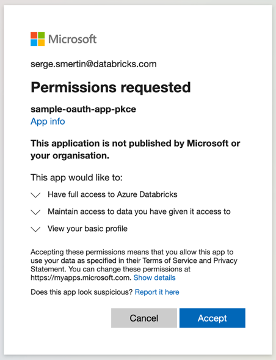

# OAuth applications with Azure AD

## Azure CLI Authentication

You can natively use credentials provided to `az login` (Azure CLI). The only argument you'll have to supply is `host`.
The SDK code for them should look like the following:

```python
from databricks.sdk import WorkspaceClient
w = WorkspaceClient(host='https://adb-30....azuredatabricks.net')
clusters = w.clusters.list()
for cl in clusters:
    print(f' - {cl.cluster_name} is {cl.state}')
```

This is the recommended way to for local-machine development with Azure Databricks, as you don't have to store any 
credentials in the clear text and Azure CLI handles it all for you. When you have to run application in production,
please supply `ARM_CLIENT_ID`, `ARM_TENTANT_ID`, and `ARM_CLIENT_SECRET` environment variables for 
the [Service Principal](#azure-active-directory-service-principals-2-legged-oauth-flow-on-cicd) auth to activate.

## PKCE 3-legged OAuth flow on local machines

You can make your command-line applications running on development machines authenticate with Azure AD Single-Page Application (SPA) flow by using creating the following application with terraform:

```hcl
data "azuread_client_config" "current" {}

resource "azuread_application" "pkce" {
  display_name     = "sample-oauth-app-pkce"
  owners           = [data.azuread_client_config.current.object_id]
  sign_in_audience = "AzureADMyOrg"
  single_page_application {
    redirect_uris = ["http://localhost:8080/"]
  }
}

output "pkce_app_client_id" {
  value = azuread_application.pkce.application_id
}
```

The SDK code for them should look like the following:

```python
from databricks.sdk import WorkspaceClient
w = WorkspaceClient(host='https://adb-30....azuredatabricks.net',
                    client_id='>>>value_from_pkce_app_client_id output<<<<',
                    auth_type='external-browser')
clusters = w.clusters.list()
for cl in clusters:
    print(f' - {cl.cluster_name} is {cl.state}')
```

It will launch a browser, prompting user to login with Azure credentials and give consent like described on the following screen:



After giving consent, the user can close the browser tab:


## Public Client 3-legged OAuth flow on local machines

You can make your command-line applications running on development machines authenticate with Public Client AuthCode flow by using creating the following application with terraform:

```hcl
resource "azuread_application" "public_client" {
  display_name     = "sample-oauth-app-public-client"
  owners           = [data.azuread_client_config.current.object_id]
  sign_in_audience = "AzureADMyOrg"
  public_client {
    redirect_uris = ["http://localhost:8080/"]
  }
}

output "public_client_id" {
  value = azuread_application.public_client.application_id
}
```

The SDK code for them should look like the following:

```python
from databricks.sdk import WorkspaceClient
w = WorkspaceClient(host='https://adb-30....azuredatabricks.net',
                    client_id='>>>value from public_client_id output<<<<',
                    auth_type='external-browser')
clusters = w.clusters.list()
for cl in clusters:
  print(f' - {cl.cluster_name} is {cl.state}')
```

## Private OAuth Apps 3-legged OAuth flow on local machines

You can make your command-line applications running on development machines authenticate with Private App AuthCode flow by using creating the following application with terraform:

```hcl
resource "azuread_application" "private_client" {
  display_name     = "sample-oauth-app-private-client"
  owners           = [data.azuread_client_config.current.object_id]
  sign_in_audience = "AzureADMyOrg"
  web {
    redirect_uris = ["http://localhost:8080/"]
  }
}

resource "time_rotating" "weekly" {
  rotation_days = 7
}

resource "azuread_application_password" "private_client" {
  application_object_id = azuread_application.private_client.object_id
  rotate_when_changed = {
    rotation = time_rotating.weekly.id
  }
}

output "private_client_id" {
  value = azuread_application.private_client.application_id
}

output "private_client_secret" {
  value = azuread_application_password.private_client.value
  sensitive = true
}
```

The SDK code for them should look like the following:

```python
from databricks.sdk import WorkspaceClient

w = WorkspaceClient(host='https://adb-30....azuredatabricks.net',
                    client_id='>>> value from private_client_id <<<',
                    client_secret='>>> value from private_client_secret <<<',
                    auth_type='external-browser')
clusters = w.clusters.list()
for cl in clusters:
    print(f' - {cl.cluster_name} is {cl.state}')
```

## Azure Active Directory Service Principals 2-legged OAuth flow on CI/CD

When running an application in an automated environment without user interaction, you should use AAD SPN flow. 
You can create AAD Service Principal with secret using the following Terraform code:

```hcl
variable "name" {
  type = string
}

resource "azuread_application" "this" {
  display_name = var.name
}

resource "azuread_service_principal" "this" {
  application_id = azuread_application.this.application_id
}

resource "time_rotating" "month" {
  rotation_days = 30
}

resource "azuread_service_principal_password" "this" {
  service_principal_id = azuread_service_principal.this.object_id
  rotate_when_changed = {
    rotation = time_rotating.month.id
  }
}

output "client_id" {
  description = "value for ARM_CLIENT_ID environment variable"
  value       = azuread_application.this.application_id
}

output "client_secret" {
  description = "value for ARM_CLIENT_SECRET environment variable"
  value       = azuread_service_principal_password.this.value
  sensitive   = true
}
```

The SDK code to use it would look like the following:

```python
from databricks.sdk import WorkspaceClient

w = WorkspaceClient(host='https://adb-30....azuredatabricks.net',
                    azure_client_id='>>> value from client_id <<<',
                    azure_client_secret='>>> value from client_secret <<<',
                    azure_tenant_id='>>> your Azure Tenant ID <<<')
clusters = w.clusters.list()
for cl in clusters:
    print(f' - {cl.cluster_name} is {cl.state}')
```

On a local machine, you can also store Azure Service Principal credentials in the `~/.databrickscfg` file and refer to 
them as `profile` argument in the SDK/CLI/Terraform configuration:

```text
[spn]
host=https://adb-30....azuredatabricks.net
azure_client_id=00000000-0000-0000-0000-000000000001
azure_client_secret=00000000-0000-0000-0000-000000000002
azure_tenant_id=00000000-0000-0000-0000-000000000003
```

The SDK code to use it would look like the following:

```python
from databricks.sdk import WorkspaceClient

w = WorkspaceClient(profile='spn')
clusters = w.clusters.list()
for cl in clusters:
    print(f' - {cl.cluster_name} is {cl.state}')
```

You can also supply the `ARM_CLIENT_ID`, `ARM_TENTANT_ID`, and `ARM_CLIENT_SECRET` environment variables instead of 
hardcoded configuration properties.